## unity-lock

lock screen for unity-desktop, that locks the running session with the
`ext-session-lock-v1` Wayland protocol and drives PAM authentication through
`astal-auth`.

### screenshots

the clock face comes from the `style` key in `org.unity.lock`. every face below
is bundled in the program, so none of them need a font installed on the host.
`default` is the session interface font, the rest link to their Google Fonts page.

| | | |
| --- | --- | --- |
| 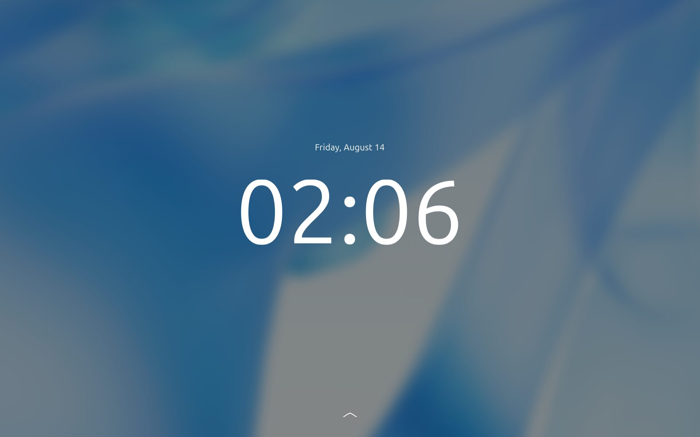<br>`default (system-font)` | 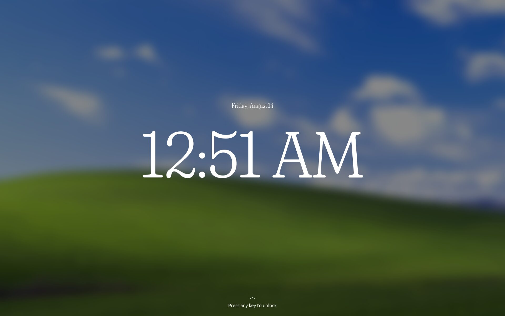<br>[`fraunces`](https://fonts.google.com/specimen/Fraunces) | 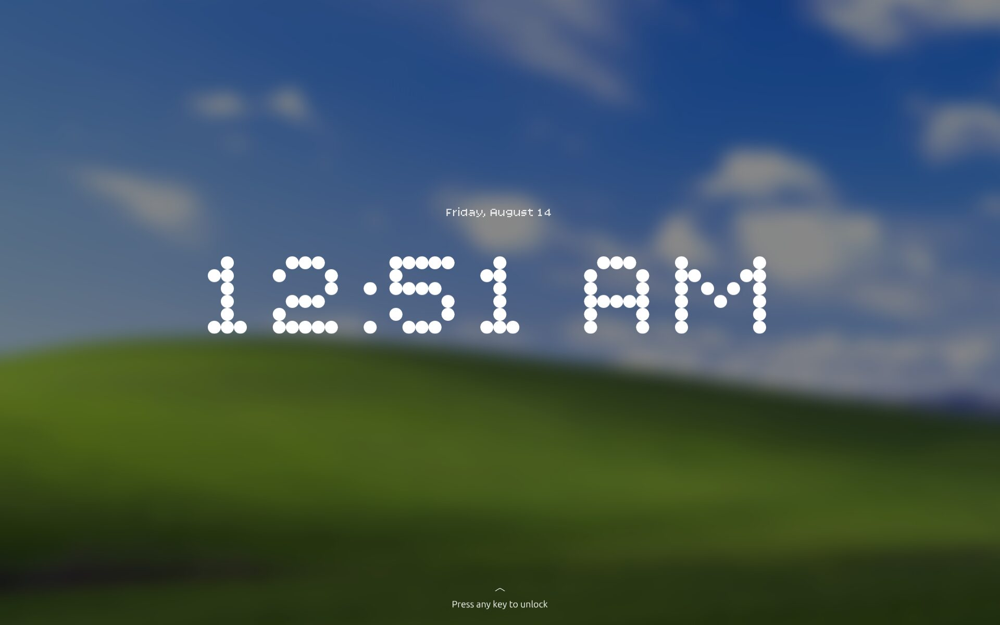<br>[`bitcount-prop-single`](https://fonts.google.com/specimen/Bitcount+Prop+Single) |
| 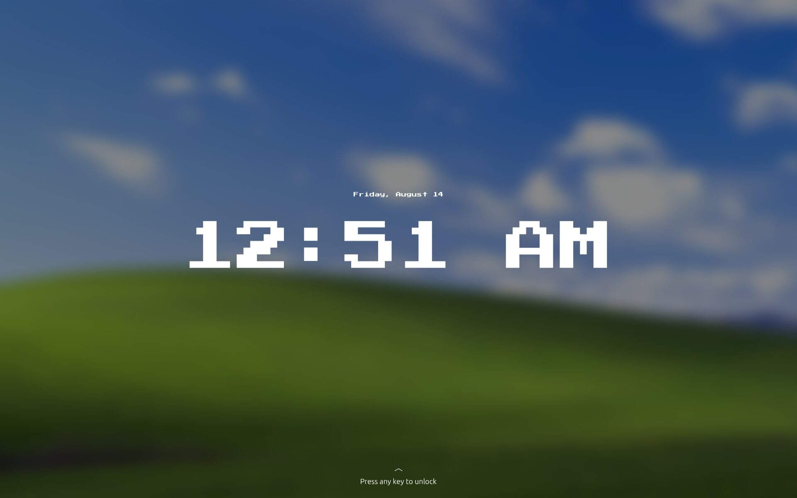<br>[`press-start-2p`](https://fonts.google.com/specimen/Press+Start+2P) | 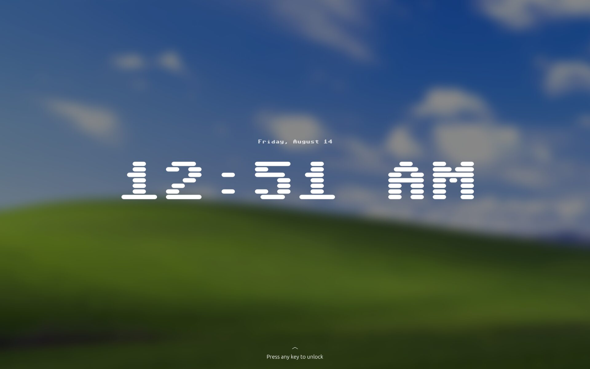<br>[`sixtyfour`](https://fonts.google.com/specimen/Sixtyfour) | 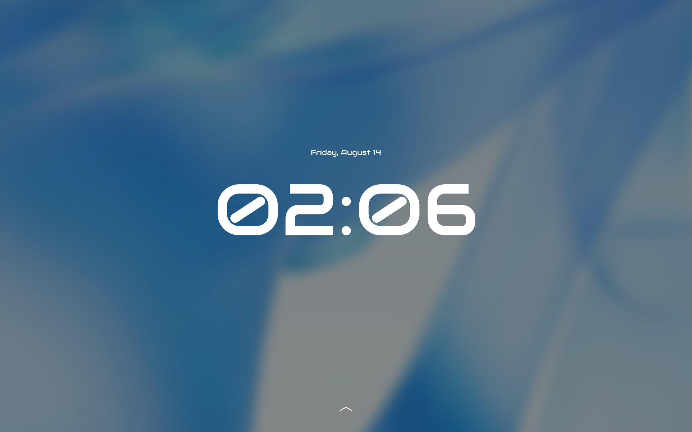<br>[`audiowide`](https://fonts.google.com/specimen/Audiowide) |
| 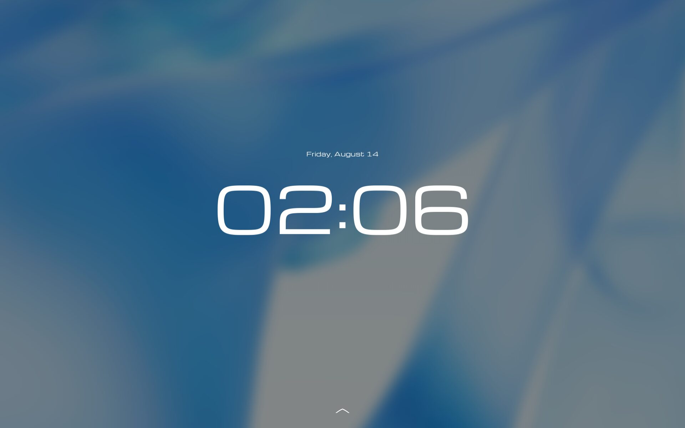<br>[`michroma`](https://fonts.google.com/specimen/Michroma) | 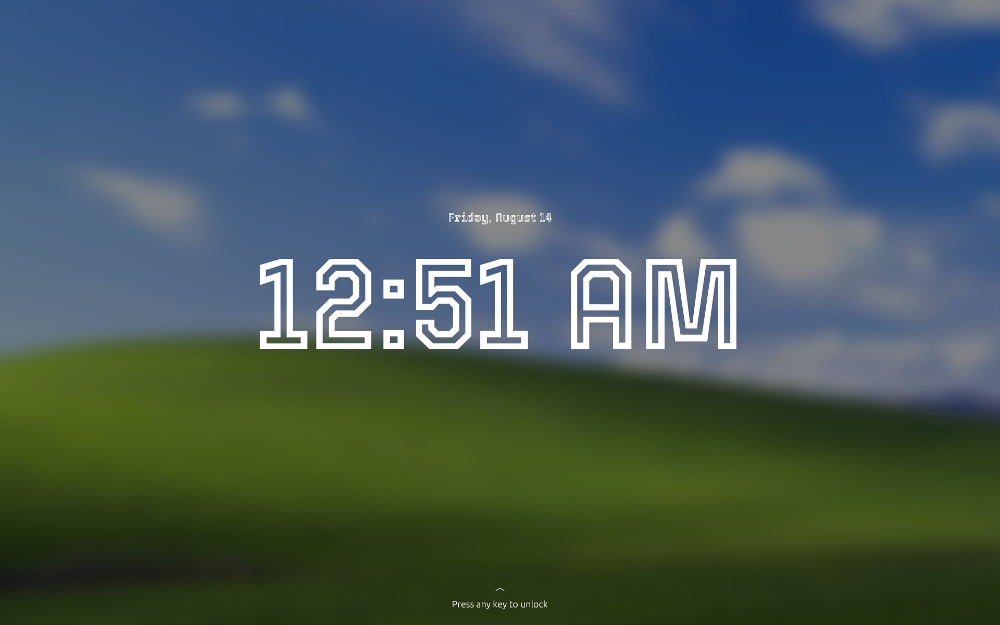<br>[`tourney`](https://fonts.google.com/specimen/Tourney) | 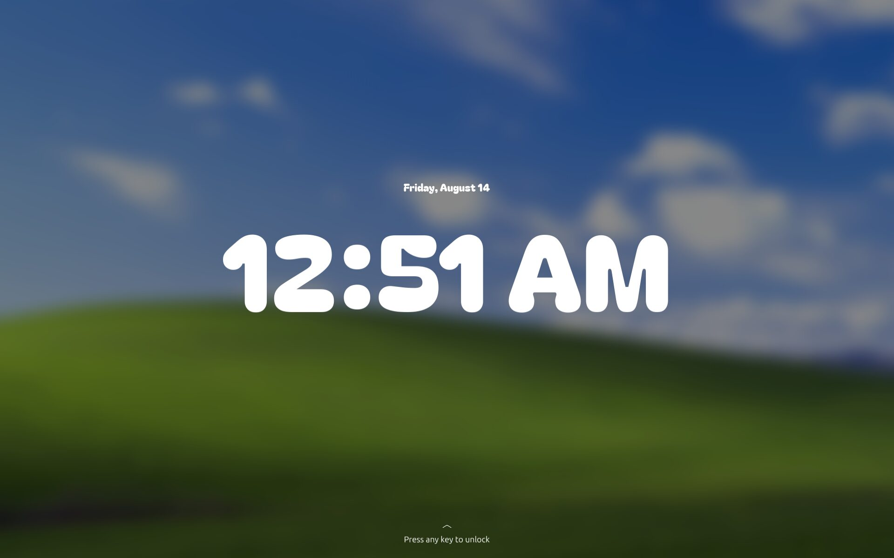<br>[`bagel-fat-one`](https://fonts.google.com/specimen/Bagel+Fat+One) |
| 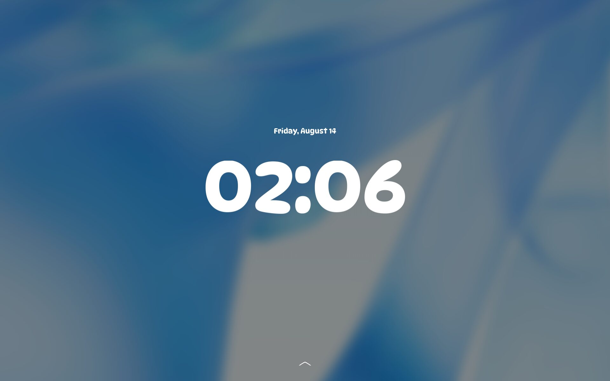<br>[`dynapuff`](https://fonts.google.com/specimen/DynaPuff) | 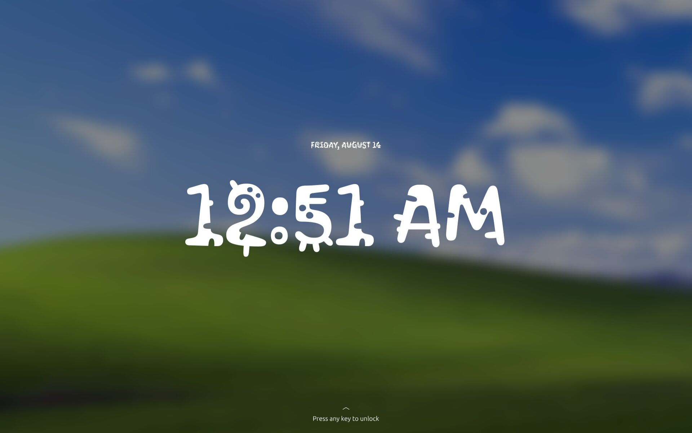<br>[`kablammo`](https://fonts.google.com/specimen/Kablammo) | <br>[`rubik-glitch`](https://fonts.google.com/specimen/Rubik+Glitch) |
| 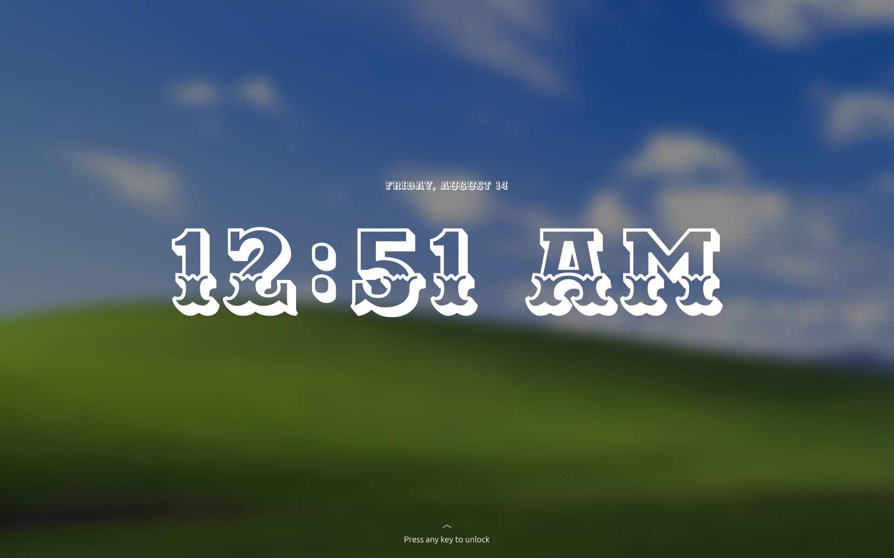<br>[`ewert`](https://fonts.google.com/specimen/Ewert) | 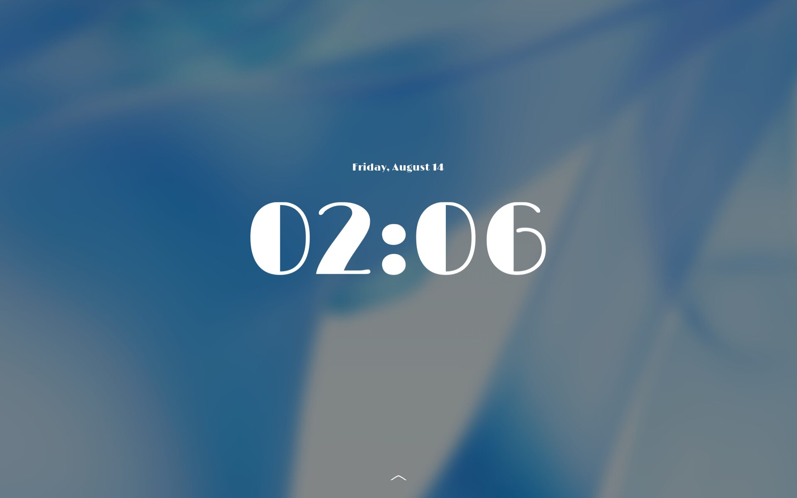<br>[`limelight`](https://fonts.google.com/specimen/Limelight) | 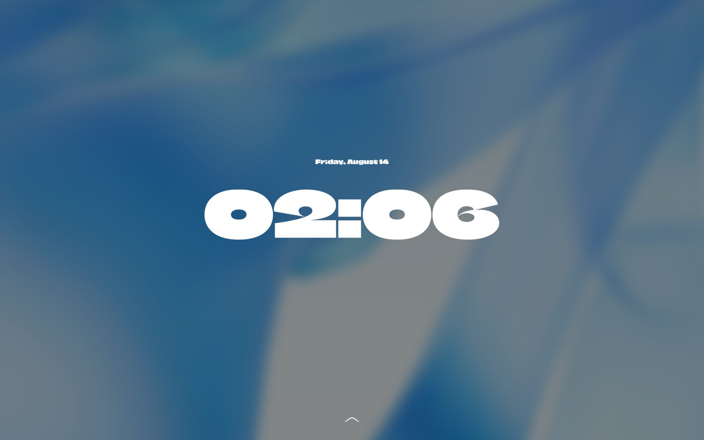<br>[`climate-crisis`](https://fonts.google.com/specimen/Climate+Crisis) |

### components

- **`UnityLock`**: one lock screen, covering one monitor. Every monitor gets the whole thing, pages and prompt, so unplugging a monitor cannot take the only prompt away with it. Holds the two pages and handles the keyboard and the mouse.
- **`UnityLockDatetimePage`**: the first page. The wallpaper with the clock over it. Scroll down, click, or press Return, Enter, space or any printable character to leave it. A printable character is carried into the password field.
- **`UnityLockUserPage`**: the second page. The avatar, the user name, the password field and the unlock button.
- **`UnityLockDatetime`**: the time and the date. Changes face to follow the settings, and shrinks on a narrow screen so the time always fits.
- **`UnityLockFontFace`**: the clock faces. Each one ships inside the program, so the fonts never have to be installed.
- **`UnityLockBackground`**: reads the published wallpaper once, decodes it once, and shares the result with every page that draws it.
- **`UnityLockConversation`**: sends the typed password to PAM and reports back what PAM answers.
- **`main.c`**: takes the lock, makes one window per monitor, and lets the lock go when PAM accepts the password.
- **Per-user wallpaper**: each user has their own lock screen picture. `unity-shell` writes it to `/var/lib/unity-greeter/<user>/background.png`, already blurred and dimmed, and the lock screen reads it back. The desktop, the login screen and the lock screen all show one image. A screen shows a plain dark background when the picture is missing.

### build

install the deps:

- `gtk4` (>= 4.22)
- `libadwaita-1` (>= 1.9)
- `gio-2.0`, `glib-2.0` (>= 2.80)
- `accountsservice` (>= 23.13.9)
- `astal-auth-0.1`
- `gnome-desktop-4`
- `pango` (>= 1.56, for `pango_font_map_add_font_file`), `pangocairo`
- `gsettings-desktop-schemas`
- `gtk4-layer-shell-0` (>= 1.0, ships `gtk4-session-lock`)
- `meson`, `ninja`

```sh
meson setup build
ninja -C build
sudo meson install -C build
```
